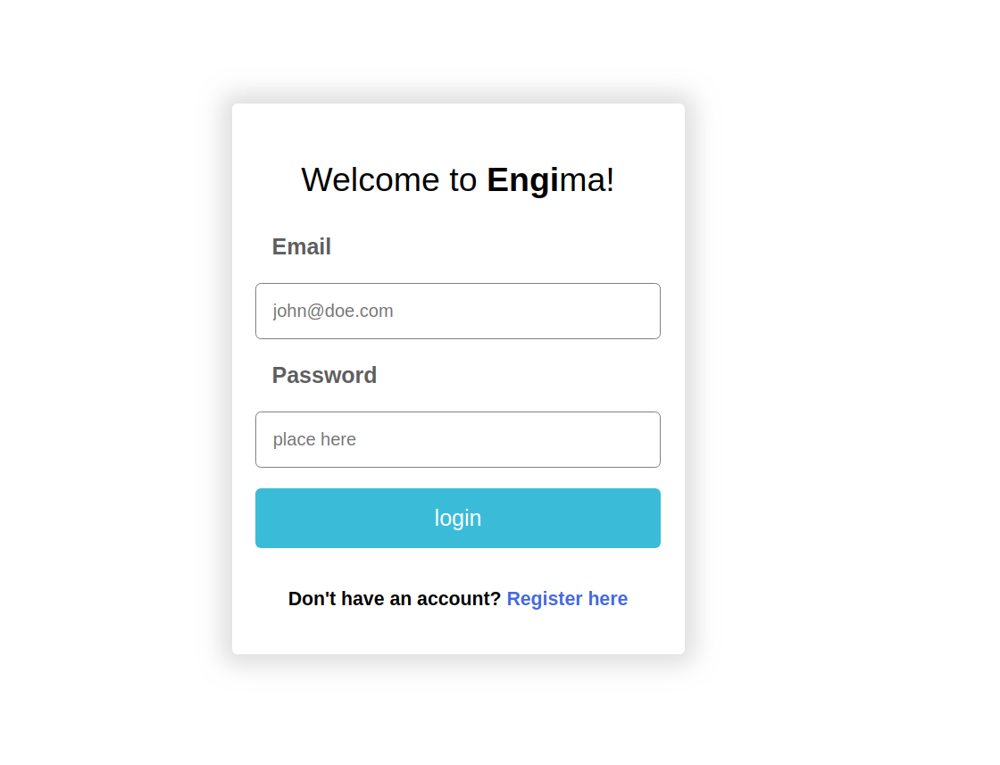
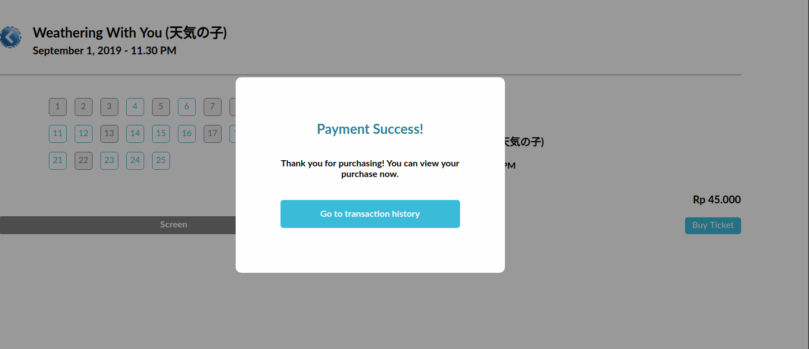

# Tugas 1 IF3110 Pengembangan Aplikasi Berbasis Web

## Deskripsi Singkat

Saat ini Engi ingin melakukan ekspansi usaha dengan membangun sebuah bioskop. Setelah berdiri selama 2 bulan, Engi merasa bioskopnya sepi dibanding bioskop kompetitor lainnya. Usut punya usut, ternyata faktor utama penyebab sepinya bioskop Engi adalah tidak adanya kemudahan pemesanan tiket secara daring. Oleh karena itu, Engi meminta Anda untuk membuat aplikasi web pemesanan tiket bioskop daring. Engi menginginkan website miliknya untuk memiliki fitur pembelian tiket, memberi ulasan pada film yang telah ditonton, login dan register, riwayat pembelian tiket.

Engi telah mempekerjakan seorang UI/UX profesional untuk mendesain tampilan *website*-nya. Anda diminta untuk mengimplementasikan tampilan sedemikian mirip dengan tampilan pada contoh. Engi tidak meminta Anda untuk membangun *website* yang *responsive*. Icon dan jenis font tidak harus sama dengan contoh. Tata letak elemen, warna font, garis pemisah, dan perbedaan ukuran font harus terlihat sesuai contoh. Format rating dan waktu harus terlihat sesuai contoh tampilan.

## Daftar Requirement

Web ini membutuhkan server XAMPP untuk berjalan dengan lancar.  
Database yang digunakan bisa dilihat di wbd.sql

## Cara Instalasi
1. Install XAMPP
2. Jalankan XAMPP
3. Cari folder HTDocs XAMPP
4. Taruh repo aplikasi ini pada folder HTDocs, atau bisa juga dengan membuat symbolic link ke folder repo
5. Buka localhost/wbd/html/login.html pada browser

## Screenschot

### Login Page

#### Login Page Wrong Password

### Register

### Home

### Film Detail

### Pemesanan Ticket

#### Pemesanan Ticket Berhasil

### Search Page

### Review

### Transaction

## Pembagian Tugas

### Frontend
1. Login : 13517013
2. Register : 13517036, 12517013
3. Home : 13517013
4. Search Result : 13517013
5. Film Detail : 13517013
6. Buy Ticket : 13517013
7. Transaction History : 13517067
8. User Review : 13517036, 12517013

### Backend
1. Login : 13517013
2. Register : 13517036, 12517013
3. Home : 13517013
4. Search Result : 13517013
5. Film Detail : 13517013
6. Buy Ticket : 13517013
7. Transaction History : 13517067
8. User Review : 13517036, 12517013
